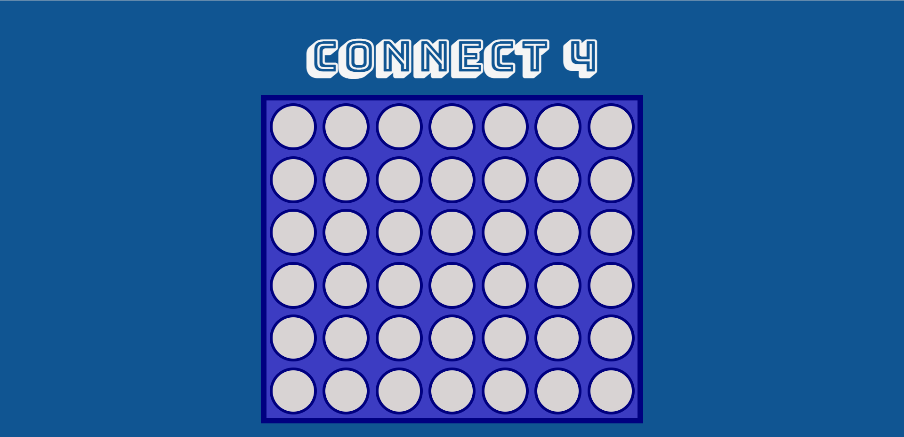
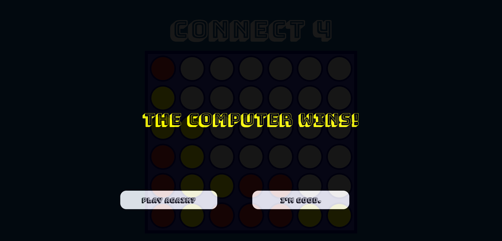

## Connect 4

This was a project idea to make a favorite childhood game. 

[-Live site](https://richard-harris1992.github.io/Connect4/)

## Build Status

Project is a static HTML/CSS/JS web site and is hosted directly from the GitHub respository via GitHub Pages

## Technologies, languages used

-HTML
-CSS
-Javascript

## Installation Instructions

1. Clone the repository 
    -Run the following in your terminal: `git clone https://github.com/Richard-Harris1992/Connect4.git`

2. Run index.html file from browser or Live-Server.

3. Enjoy!

## Game mechanics:

1. Two players (User vs PC)

2. Gameplay

    - Starting with the user, they will drop their first coin.
    - The computer will then play.
    - There are 3 End states:
        - Win State
        - Lose State
        - Draw State
    - Once one of the above conditions is met, the user will have the option of starting a new game or to just take a look at the end state of the board.

    ##Future developments

    I would like to one day implement a minimax algorithm with alpha-beta pruning.
